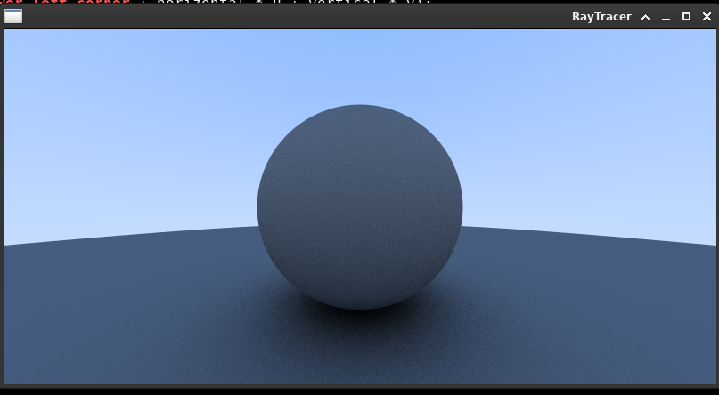
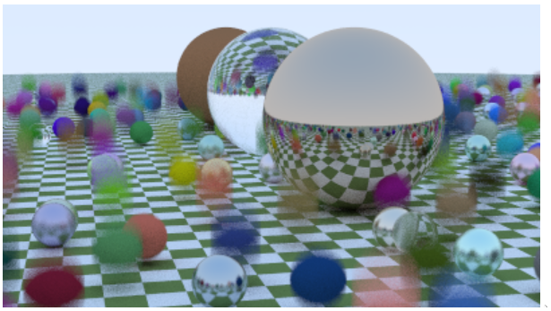
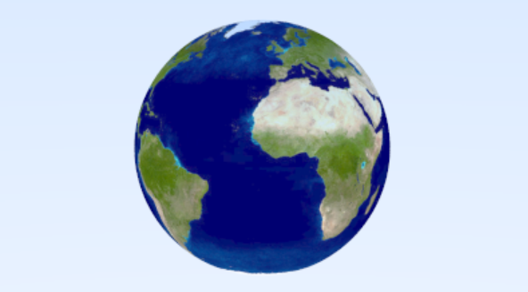
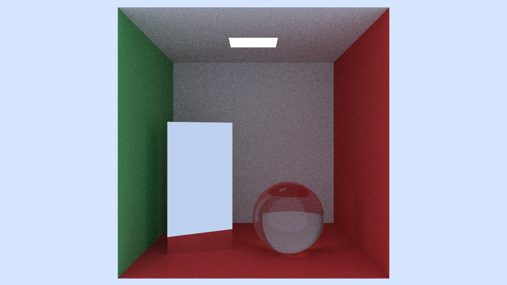

# Raytracer

This is a raytracer written in C++/SFML for the Epitech second year project. The duration of the project was 4 weeks.

You can find the wiki [here](https://github.com/Sinan-Karakaya/Raytracer-cpp/wiki).

## Dependencies

```bash
sudo apt-get install libsfml-dev
sudo apt-get install libsfml-dev
sudo apt-get install libconfig++-dev`
```

## How to build

```bash
mkdir build
cd build
cmake .. -G Ninja
ninja
```

## Results




